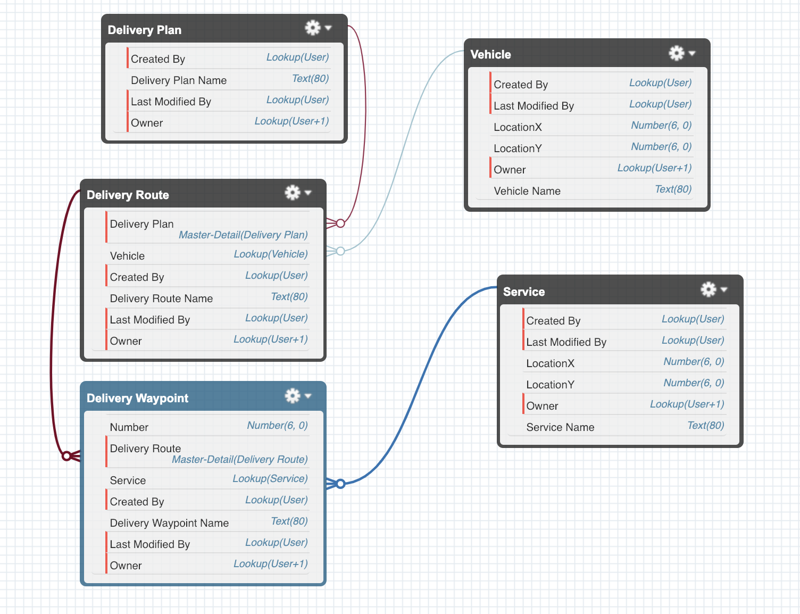

# Route Planner Demo

## Node.js + Platform Events

This demo uses a combination of Flow, Salesforce Functions, CDC, and Lightning Web Components.

Demo flow:

- Open account record
- Click Quick Action "New Delivery"
- Enter data in Flow, which will create a Platform Event
- Wait for "Current Deliveries" to update (CDC listens in LWC)

### Salesforce org setup

This demo uses Salesforce Functions local development environment integrated with a scratch org, you can use a Developer Edition Org.

1. Create a scratch org.

```zsh
sfdx force:org:create -s -f config/project-scratch-def.json -a routeplannerdemo
```

2. Push source to scratch org.

```zsh
sfdx force:source:push
```

3. Assign permissionset

```zsh
sfdx force:user:permset:assign -n RoutePlanner
```

4. Import sample data

```zsh
sfdx force:data:tree:import -p data/Account-Service__c-plan.json
```

5. Open the org

```zsh
sfdx force:org:open
```

6. In _Setup_ go to _Data_ -> _Data Integration Rules_, and activate _Geocodes for Account Shipping Address_.

### Functions setup

As the DX is in flux this section only describes the minimum needed information.

- The function for this demo is located in `functions/routeplanner`.
- The permissionset to use is `RoutePlanner` - for function assignment _and_ for the Platform Event assignment.

## Route Planner Function



Once you complete the steps below to setup and run the Function you should see these records. **DELIVERYROUTE\_\_R.NAME** shows the route the vehicle should take and **NUMBER\_\_C** represents the waypoints on that route to each service location in the most optimal order.

```
DELIVERYPLAN__C                          DELIVERYROUTE__R.NAME  VEHICLENAME__C  NUMBER__C  SERVICE__R.NAME
───────────────────────────────────────  ─────────────────────  ──────────────  ─────────  ────────────────────────────
Delivery Plan @ 2019-02-09 15:43:09.845  R-00000000             Van             1          Delivery to Beniof Mansion
Delivery Plan @ 2019-02-09 15:43:09.845  R-00000000             Van             3          Delivery to Landmark
Delivery Plan @ 2019-02-09 15:43:09.845  R-00000001             Van             2          Delivery to Salesforce Tower
Delivery Plan @ 2019-02-09 15:43:09.845  R-00000001             Van             4          Delivery to Salesforce West
```

## Local Development

On a terminal run the following:

```
cd functions/routeplanner
sf run function start
```

On another terminal run the following:

```
cd functions/routeplanner
sf run function -l http://localhost:8080 -p=@data/sample-payload.json
```
